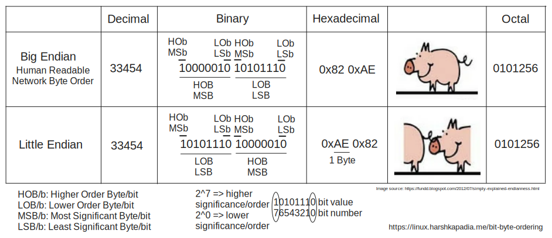

# Bit and Byte Ordering

-   Endianness (Little-Endian vs Big-Endian), Network Byte Order, etc.
-   [Simply Explained: Byte Ordering](https://fundd.blogspot.com/2012/07/simply-explained-endianness.html)
-   [Big Endian and Little Endian](https://www.tutorialspoint.com/big-endian-and-little-endian)
-   [Why are both little- and big-endian in use?](https://stackoverflow.com/questions/4752715/why-are-both-little-and-big-endian-in-use)
-   [Use cases for Little Endian and Big Endian](https://thebittheories.com/little-endian-vs-big-endian-b4046c63e1f2)
-   [Bit Ordering vs Byte Ordering](https://stackoverflow.com/questions/2635484/bit-ordering-and-endianess)
-   [IEN 137: On Holy Wars and a Plea for Peace](https://www.rfc-editor.org/ien/ien137.txt)
    -   Origin of the names 'Big-Endian' and 'Little-Endian' came from Gulliver's Travels, as defined in IEN 137!
-   Network
    -   [Why is network-byte-order defined to be big-endian?](https://stackoverflow.com/questions/13514614/why-is-network-byte-order-defined-to-be-big-endian)
    -   [Network Byte Order](https://networkengineering.stackexchange.com/questions/24269/network-byte-order)
    -   [`htons()` function in socket programing](https://stackoverflow.com/questions/19207745/htons-function-in-socket-programing)
    -   `htons()`, `ntohs()`, `htonl()`, `ntohl()`, etc.
        -   `n` = Network Byte Order
        -   `h` = Host Byte Order
        -   `s` = Short (Size)
        -   `l` = Long (size)
