# A Practical Guide to Using KVM/QEMU

Published on: 5th July 2025

Last updated: 4th August 2025

[Back home](README.md)

## Table of Contents

-   [Introduction](#introduction)
-   [Terms](#terms)
-   [Components](#components)
-   [Setup KVM/QEMU](#setup-kvmqemu)
    -   [Base Setup](#base-setup)
    -   [Setting Up Networking for VMs](#setting-up-networking-for-vms)
        -   [NAT Setup](#nat-setup)
        -   [Bridged Setup](#bridged-setup)
            -   [Configuring Netplan](#configuring-netplan)
            -   [Configuring KVM/QEMU With the Bridged Network](#configuring-kvmqemu-with-the-bridged-network)
-   [Downloading OS Images (ISOs)](#downloading-os-images-isos)
-   [Spinning Up VMs](#spinning-up-vms)
    -   [Spinning Up VMs Using a GUI - `virt-manager` Only](#spinning-up-vms-using-a-gui---virt-manager-only)
    -   [Spinning Up VMs Using a CLI - `virt-install` Only](#spinning-up-vms-using-a-cli---virt-install-only)
    -   [Spinning Up VMs Using a CLI - `virt-install` with `cloud-init`’s `autoinstall`](#spinning-up-vms-using-a-cli---virt-install-with-cloud-inits-autoinstall)
    -   [Spinning Up VMs Using a CLI - `virt-builder` and `virt-install`](#spinning-up-vms-using-a-cli---virt-builder-and-virt-install)
-   [Managing VMs](#managing-vms)
    -   [`virt-manager`](#virt-manager)
    -   [`virsh`](#virsh)
-   [Accessing/Viewing VMs](#accessingviewing-vms)
    -   [`virt-manager`](#virt-manager-1)
    -   [VNC Viewers](#vnc-viewers)
        -   [VNC Configuration](#vnc-configuration)
            -   [GUI](#gui)
            -   [CLI](#cli)
        -   [Accessing VMs Remotely](#accessing-vms-remotely)
        -   [Accessing VMs Locally](#accessing-vms-locally)
    -   [`virt-viewer`](#virt-viewer)
-   [Resources](#resources)

## Introduction

KVM/QEMU are virtualization software available in all Linux distros and are a quick way to spin up Virtual Machines (VMs).

NOTE: This guide is for Ubuntu and has been tested on an Ubuntu 24.04.2 LTS (Linux 6.8.0-62-generic x86_64) host machine.

## Terms

-   Host
    -   The machine on which VMs are hosted.
-   Guest
    -   The VMs running on the host machine are guests.
-   BMC
    -   Baseboard Management Console
-   OS
    -   Operating System
-   VM
    -   Virtual Machine
-   NAT
    -   Network Address Translation
-   VNC
    -   Virtual Network Computing

## Components

-   KVM
    -   In this article's context, KVM stands for [Kernel-based Virtual Machine](https://linux-kvm.org) and **not** [Keyboard, Video and Mouse](https://en.wikipedia.org/wiki/Rackmount_KVM).
    -   It is a Linux kernel module available on all Linux distributions that enables virtualization.
    -   It is a hypervisor.
    -   It enables VMs to directly use (passthrough) CPU cores and RAM with complete isolation/separation/privatization from the host OS and the other guests on the host, using CPU instruction set extensions like AMD-V or Intel-VT.
    -   It does not provide other peripheral hardware for VMs.
-   QEMU
    -   [Quick EMUlator](https://www.qemu.org)
    -   It can emulate hardware like CPU, RAM (memory), disks (HDD), keyboard, mouse, USB, ethernet controllers, SCSI adapters, VGA, audio devices, etc.
    -   It is capable of running an entire VM by itself, but provides slower than native performance, as it only emulates the hardware.
    -   KVM provides near-native/near-bare metal performance with CPU and RAM (due to running directly on physical hardware), so QEMU is often used with KVM.
    -   This is why the phrase ‘KVM/QEMU’ is often used.
    -   In such a setup, KVM provides the CPU and RAM, while QEMU emulates the peripheral hardware.
-   [Libvirt](https://wiki.archlinux.org/title/Libvirt)
    -   It is a library and set of tools to manage KVM/QEMU (and other hypervisors).
    -   It consists of various tools like
        -   `virsh`
            -   CLI tool to manage VMs, VM networking and other resources
            -   Calls VMs 'domains'
        -   `virt-manager`
            -   GUI to create and manage VMs
            -   Includes tools like `virt-install`.
        -   `virt-viewer`
            -   A viewer client for a remote display, i.e., a VM's display.
-   [Libguestfs](https://libguestfs.org)
    -   A library and set of tools to manage VM disk images.
    -   It consists of various tools like
        -   `virt-builder`
            -   Quickly customize and build OS images
            -   It customizes images already prepared by the Libguestfs teaam.
        -   `virt-resize`
            -   Resize VM disks
            -   Eg: Resize a VM QCOW2/raw volume (disk) from 10 GB to 50 GB.

## Setup KVM/QEMU

### Base Setup

High-level steps

-   Install required packages
-   Add the user that is going to be spinning up VMs to the libvirt and kvm groups.
-   Start the libvirtd daemon
-   Reboot the system

The above steps as a Bash script:

```bash
#! /bin/bash

set -Eeuo pipefail

sudo apt-get update
sudo apt-get install -y qemu-kvm libvirt-daemon-system libvirt-clients bridge-utils virtinst virt-manager cpu-checker libguestfs-tools libosinfo-bin libnss-libvirt

sudo adduser "$(whoami)" libvirt
sudo adduser "$(whoami)" kvm

sudo systemctl enable --now libvirtd

echo ""
echo "KVM/QEMU installed! The system will reboot in 10 seconds..."
echo ""

sleep 10
sudo reboot now
```

Name the above script `install-kvm-qemu.sh` and execute it **without** sudo permissions. The script will prompt for the sudo password when required.

```bash
$ vim install-kvm-qemu.sh # Paste the contents from the codeblock above
$ chmod +x install-kvm-qemu.sh
$ ./install-kvm-qemu.sh
```

NOTE: The system will reboot after the installation.

### Setting Up Networking for VMs

After setting up KVM/QEMU, networking for VMs has to be setup.

There are two main ways to go about networking the VMs

-   NATed
    -   Default setup, no configuration required
    -   NAT: Network Address Translation
-   Bridged
    -   Needs to be set up

NOTE: VMs have to be assigned networks while creation, so both types of networks can co-exist and any network option can be chosen per VM.

#### NAT Setup

By default, KVM creates a private subnet using a virtual bridge interface (e.g.: virbr0) and assigns IPs to VMs from that subnet. This is a NATed (Network Address Translated) setup.

As per a typical NAT setup, VMs are assigned private IP addresses, so they can communicate with the world outside the host machine, but the outside world cannot get to them directly via their IP address. (VMs within the private subnet can still communicate with each other’s IP address.)

Nothing needs to be done to setup NATed VMs. It is the default setup of KVM/QEMU.

#### Bridged Setup

If VMs need to be able to be reached from outside the host via their IP addresses, then KVM/QEMU needs to be setup in bridged mode.

In the bridged mode, each VM gets its own public/externally routable IP address.

One physical interface is chosen, from whose subnet, IP addresses are granted to the VMs.

High-level steps

-   Create a network bridge using Netplan
-   Configure KVM/QEMU to work with the bridge using Virsh

##### Configuring Netplan

Netplan is a way to configure NetworkManager or Systemd-Networkd.

In `/etc/netplan`, there might be one or more YAML files. We will modify the highest numbered YAML file, but after creating a copy of it.

```bash
$ cd /etc/netplan
$ ls
10-network.yaml
50-netplan.yaml # This is the highest numbered file, so we will create a backip of this file and then modify the original file
$ cp 50-netplan.yaml 50-netplan.yaml.backup
```

The reason to create a backup file is so that the original file state can be restored in case of any network connectivity issues. (In case of a server, the BMC KVM can be used to revert to the original file in case host OS network connectivity is lost.)

Now, from the above example commands, the `50-cloud-init.yaml` file needs to be created such that it should represent the state of the system’s networking.

Out of all physical network interfaces (visible using the command `ip a`), choose the one from whose subnet the VMs should get their individual IPs. That chosen interface will be included in the bridge in the Netplan, as shown below. (Other physical interfaces can either just be mentioned in the file with basic/obvious settings as shown below or can be omitted to not interfere with their settings.)

A sample Netplan file (`50-netplan.yaml`):

```yaml
# Sample Netplan file
#
# Uses systemd-networkd over NetworkManager as it is recommended for simple server setups.
#
# Bridges are only required if VMs need to be operated in bridged mode and not
# their default NAT mode. This is for VMs spun up using KVM/QEMU.
#
# virbr0 should not be mentioned in the file as it is not bound to any physical
# interface.

network:
    version: 2
    renderer: networkd
    ethernets:
        eno1: # Physical interface
            dhcp4: true
            dhcp-identifier: mac
        eno2: # Physical interface
            dhcp4: true
            dhcp-identifier: mac
    bridges:
        br0:
            dhcp4: true
            dhcp-identifier: mac
            interfaces:
                - eno2
        br1: # Optional bridge in case VMs need multiple interfaces
            dhcp4: true
            dhcp-identifier: mac
            interfaces:
                - eno1
```

Once a Netplan file in the format above has been created, these changes need to be applied for them to take effect.

The following command will apply the changes in the Netplan file and there will be a loss in host OS network connectivity for a few minutes. The local OS (i.e., the OS from which the host OS is accessed) might have to have its DNS cache flushed to recognize the host OS's IP address change caused by the following command. (In case the host doesn’t come back up in a few minutes, use the server’s BMC KVM to revert back to the original file and run the command below. Expect a momentary loss in host OS network connectivity once again.)

```bash
$ sudo netplan apply
```

Reboot the system and then confirm that the bridge mentioned in the Netplan file is visible in the output of the `ip a` command.

##### Configuring KVM/QEMU With the Bridged Network

A network which uses the above created bridge needs to be created for the VMs to be able to use the bridge.

Create the following XML file at any location with any name and modify it to fit the desired setup.

`kvm-hostbridge.xml`:

```xml
<network>
  <name>hostbridge</name>
  <forward mode="bridge"/>
  <bridge name="br0"/>
</network>
```

Now, use Virsh to create the network for KVM/QEMU to use.

```bash
$ virsh net-define /path/to/kvm-hostbridge.xml
$ virsh net-start hostbridge
$ virsh net-autostart hostbridge
$ virsh net-list --all
 Name         State    Autostart   Persistent
-----------------------------------------------
 default      active   yes         yes          # This is the NATed network that KVM/QEMU creates by default
 hostbridge   active   yes         yes          # This is the bridged network that uses bridge `br0`
```

Reboot the system again.

## Downloading OS Images (ISOs)

KVM/QEMU is capable of various ways of installing an OS, e.g.: PXE booting, ISO-based boot, etc., but using an ISO is the most common way of setting up VMs.

ISO files of the OSs needed to be spun up in VMs will be required to install the OSs in the VMs. These files can be downloaded from the OS vendor’s official site.

## Spinning Up VMs

-   GUI
    -   Using `virt-manager`
-   CLI
    -   Using `virt-install`
    -   Using `virt-install` with `cloud-init`’s `autoinstall`
    -   Using `virt-builder` and then `virt-install`
        -   Not recommended

### Spinning Up VMs Using a GUI - `virt-manager` Only

`virt-manager` provides a GUI to make it easier to spin up VMs.

Invoke `virt-manager` by searching for it in the system or use the command line to invoke it.

```bash
$ sudo cp ~/.Xauthority /root # Execute this command only if there is a permissions issue with X11 forwarding
$ virt-manager
```

A window as seen below will appear.

<p align="center">
    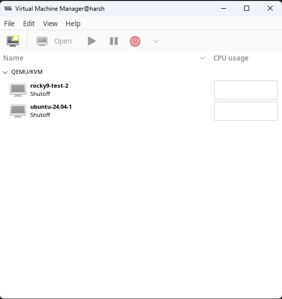
	<br />
    <sub><code>virt-manager</code></sub>
</p>

Click on the top left icon to create a new virtual machine.

<p align="center">
    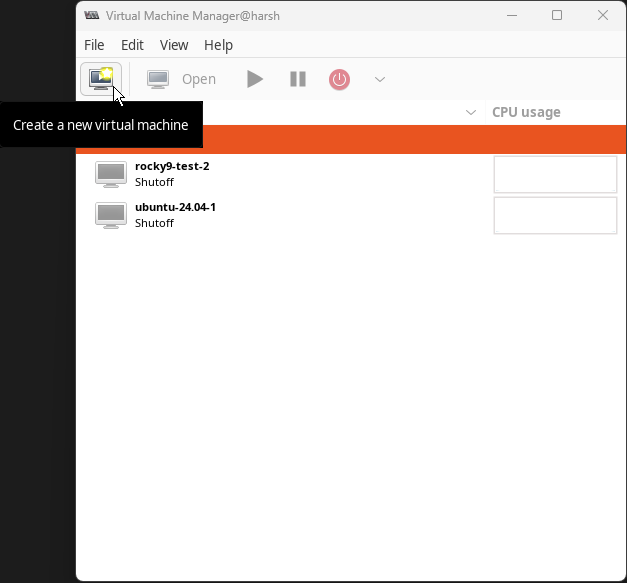
</p>

A new window will pop up. After choosing the 'Local install media' option, click 'Forward'.

<p align="center">
    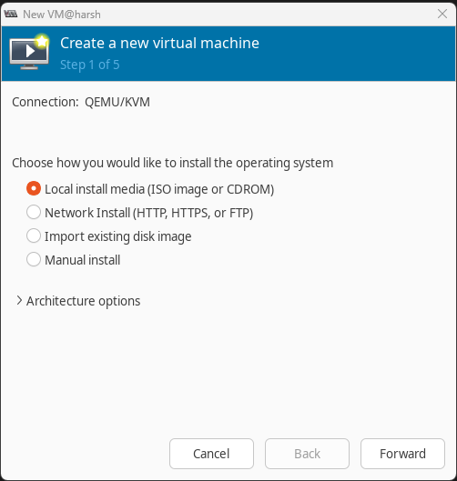
</p>

After that, click on 'Browse…' to choose the downloaded ISO file for the OS that has to be spun up in the VM.

<p align="center">
    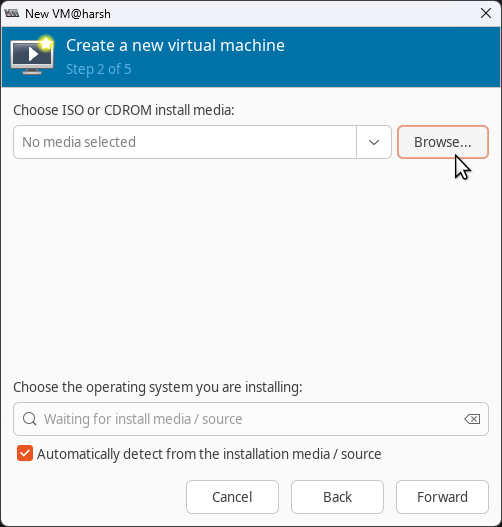
</p>

Another window will pop up to locate the ISO on the host machine. Click the green `+` icon at the **bottom left** of the window to add a pool. A pool is just a directory in this case. It is preferable to keep the same types of files in the same pool (e.g.: ISOs in one pool, VM disks in another pool, etc.), but this is just convention and is not mandatory.

<p align="center">
    
</p>

Yet another window will pop up, to add a new storage pool. In this window, give a desired name to the storage pool and choose the directory where the ISO file is located. Click on 'Finish' when done.

<p align="center">
    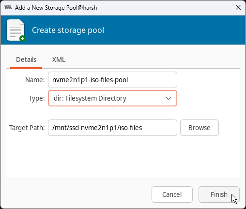
</p>

The new storage pool, `nvme2n1p1-iso-files-pool` in this case, should be visible in the original ISO location window. Click on the pool in the left column and then the blue refresh icon in the pool section. The desired ISO should now be visible. Click on the desired ISO and then click on the 'Choose Volume' button to go back to the VM creation window.

<p align="center">
    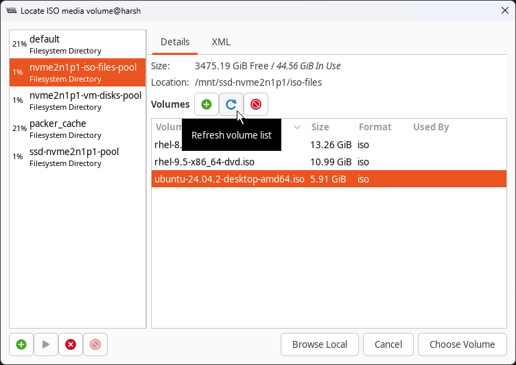
</p>

Now in the original VM creation window, ensure the correct OS is listed at the bottom and then click on 'Forward'.

<p align="center">
    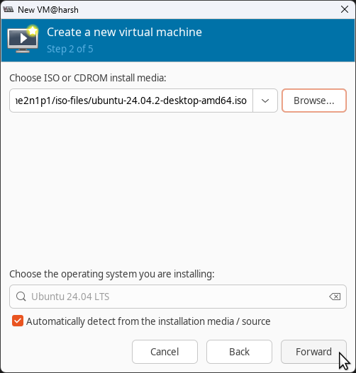
</p>

Next, choose the appropriate amount of memory (RAM) and CPU cores the VM will require. Click 'Forward' post that. This can be modified post VM creation as well.

<p align="center">
    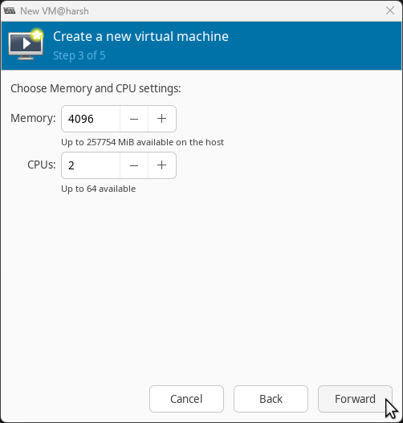
</p>

VM storage configuration is the what the next window is about. Check the 'Enable storage from this virtual machine' box. Choose the 'Select or create custom storage' option and then click on 'Manage…'

<p align="center">
    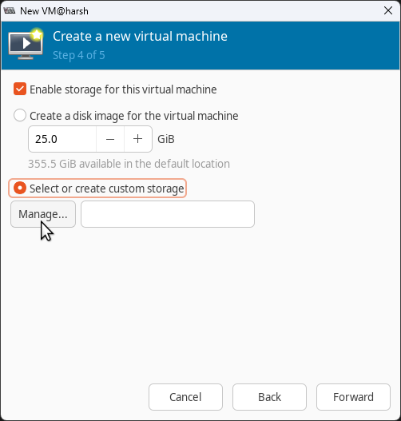
</p>

Another window will open up, to choose/create a storage pool. Preferably, create a pool (directory) only for VM disks and in the future, keep all the VM storage disks in this pool. Although this is not mandatory, it makes management of disks easier and uniform. Click the green `+` icon at the **bottom left** of the window to add a pool.

<p align="center">
    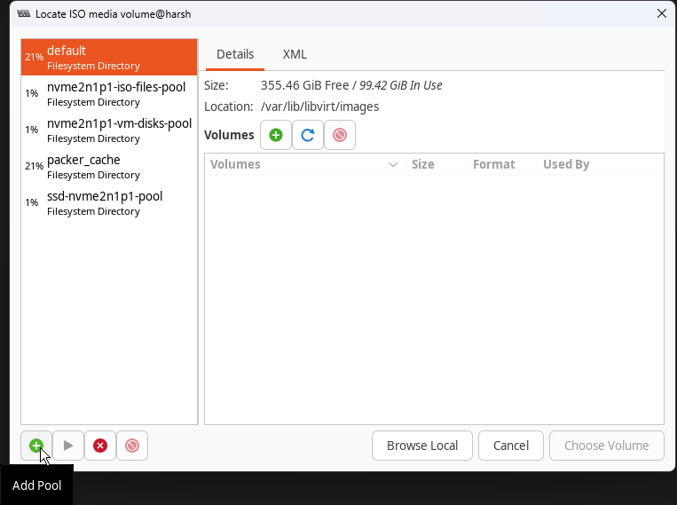
</p>

A new window will pop up, to add a new storage pool. In this window, give a desired name to the storage pool and choose the directory where the ISO file is located. Click on 'Finish' when done.

<p align="center">
    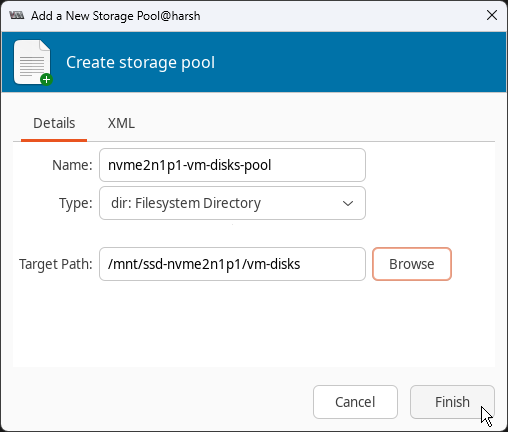
</p>

The new storage pool, `nvme2n1p1-vm-disks-pool` in this case, should be visible in the original storage pool location window. Click on the pool in the left column and then the green `+` icon in the right panel to create a new volume in the newly created pool.

<p align="center">
    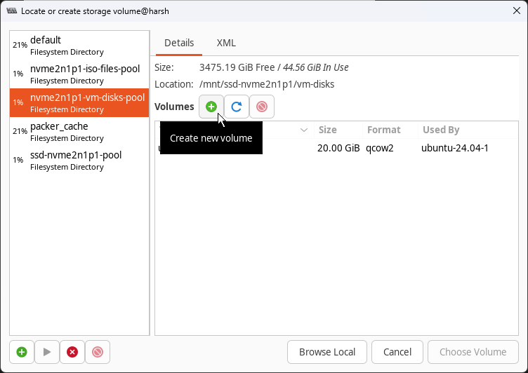
	<br />
    <sub></sub>
</p>

A new window to create a new storage volume (i.e., storage disk/hard drive for the VM) will open up. Give the disk/volume a name, keep the format 'qcow2' unless instructed otherwise, choose an appropriate capacity for the disk and then click on 'Finish'.

<p align="center">
    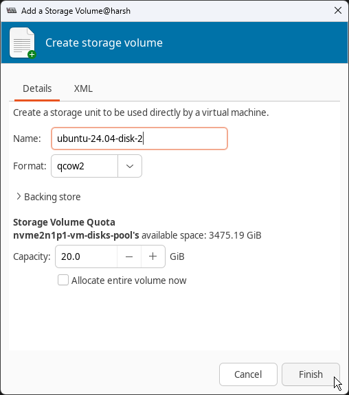
</p>

Back in the storage pool locator window, in the created VM disk storage pool (`nvme2n1p1-vm-disks-pool`), click on the blue refresh button, then click on the newly created VM storage volume/disk and then click on 'Choose Volume'.

<p align="center">
    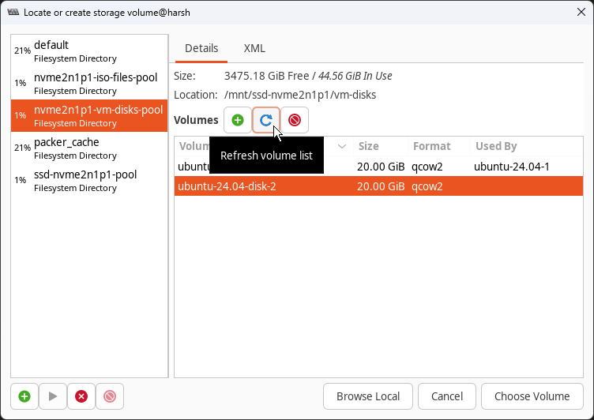
</p>

One should be back in the original VM creation window after this. Click on 'Forward'.

<p align="center">
    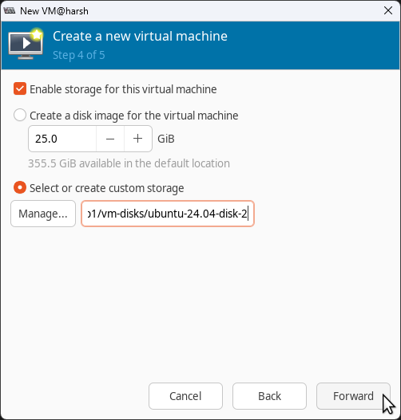
</p>

Now, on the final screen before starting the VM, give a name to the VM and choose the network it should use. Expand the 'Network selection' section and choose the default NAT setup or any bridge that might have been created. Click on 'Finish' to start the VM creation process, which begins with OS installation.

<p align="center">
    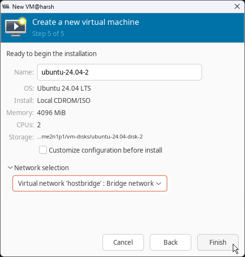
</p>

A new window should now pop up, showing the OS installation process. Guide the OS through this OS installation process and one should have a brand new VM to work with, as seen below!

<p align="center">
    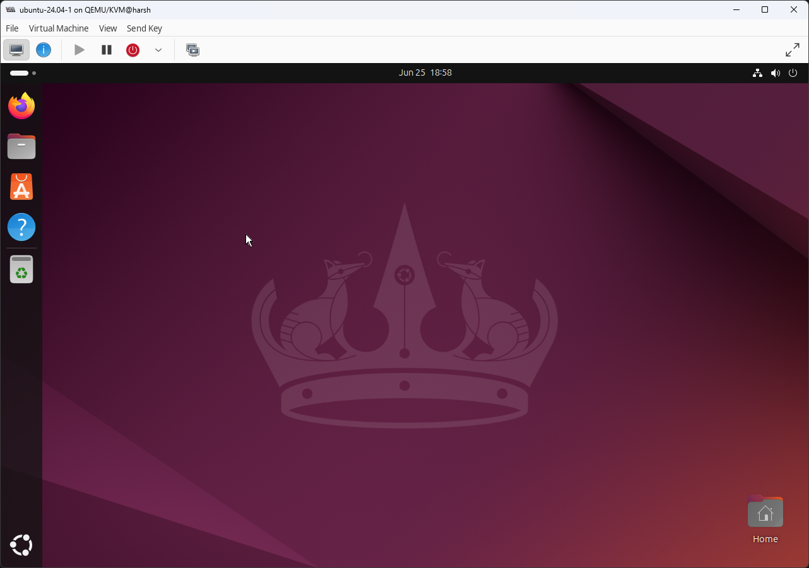
</p>

### Spinning Up VMs Using a CLI - `virt-install` Only

`virt-install` is a utility that can be used to spin up VMs from the CLI.

Sample script to spin up VMs using `virt-install`:

```bash
#! /bin/bash

set -Eeuo pipefail

# The `--osinfo` flag is the newer name for the `--os-variant` flag
# The value for the `--osinfo` flag is the 'Short ID' from the command `osinfo-query os`
#
# Multiple networks can be provided by mentioning the `--network` flag multiple
# times as follows:
# --network network="hostbridge" \
# --network bridge="br0"

virt-install \
	--name ubuntu-vm-1 \
	--vcpus 2 \
	--memory 4096 \
	--osinfo ubuntu24.04 \
	--network network=hostbridge \
	--graphics vnc,listen=0.0.0.0 \
	--location /mnt/ssd-nvme2n1p1/iso-files/ubuntu-24.04.2-desktop-amd64.iso,kernel=casper/vmlinuz,initrd=casper/initrd \
	--disk path=/mnt/ssd-nvme2n1p1/vm-disks/ubuntu-24.04-disk-1.qcow2,size=20,format=qcow2
```

This `virt-install` command will create a domain (VM) with the name `ubuntu-24.04-vm-1` with 2 CPU cores and 4096 bytes of memory (RAM). The domain is of type `ubuntu24.04` (this apparently enables OS-specific optimizations), uses the `hostbridge` bridged network and uses VNC to provide graphics. The VNC connection will accept requests from any machine that can reach it, even external ones (because of the `0.0.0.0`), if they reach the correct VNC port (more on this later). On connecting, they must input a password (`test` in this case) to gain access to the GUI. The location of the ISO file (and the kernel and initial ramdisk - both relative to the ISO file) are mentioned, along with the storage disk the OS should be installed in.

Name the above script `create-ubuntu-vm-virt-inst` and execute it without sudo permissions.

```bash
$ vim create-ubuntu-vm-virt-inst # Paste the contents from the codeblock above
$ chmod +x create-ubuntu-vm-virt-inst
$ ./create-ubuntu-vm-virt-inst
```

A `virt-viewer` window will open up to start the OS installation. VNC displays can always be started using the instructions in [the ‘Accessing/Viewing VMs’ section](#accessingviewing-vms) below.

### Spinning Up VMs Using a CLI - `virt-install` with `cloud-init`’s `autoinstall`

Automating the OS install is quicker than having to take the installer through all the steps manually. Ubuntu’s `cloud-init` provides ways to automate the installation process.

There are just way too many options and ways to do this to document them all. It’s also a convoluted mess (for a beginner like me) that I haven’t completely unraveled.

`cloud-init`’s `user-data` file is what is going to be used to automate the installation of Ubuntu.

Create the following `user-data` file at any location with any name.

```yaml
#cloud-config

# The above comment is required by cloud-init to recognize the file. Do not
# remove it.
#
# Documentation for autoinstall:
# - https://askubuntu.com/questions/1473018/installing-packages-via-autoinstall-vs-user-data
# - https://canonical-subiquity.readthedocs-hosted.com/en/latest/explanation/cloudinit-autoinstall-interaction.html
# - https://canonical-subiquity.readthedocs-hosted.com/en/latest/reference/autoinstall-reference.html

autoinstall:
    version: 1
    identity:
        realname: harsh
        username: harsh
        password: "$y$j9T$ybLGApDBbVTQ9wmqN9uAt/$573Sfobb2R6ehnEhgzZfjttQVgRx2xzHP43rFaBC4j3" # 'harsh' generated using `mkpasswd`
        hostname: harsh-test-1
    storage:
        layout:
            name: lvm
            sizing-policy: all
            match:
                size: smallest
```

The above `user-data` file creates a user and sets their name, username, hostname and password. The user has sudo permissions. It also instructs the installer to install the OS on the smallest available disk on the system and to occupy the entire disk with an LVM partition. Loads of [other options](https://canonical-subiquity.readthedocs-hosted.com/en/latest/reference/autoinstall-reference.html) can be configured with `autoinstall`.

Now, spin up a new VM using the `create-ubuntu-vm-virt-inst-auto` script below.

```bash
#! /bin/bash

set -Eeuo pipefail

# The `--osinfo` flag is the newer name for the `--os-variant` flag
# The value for the `--osinfo` flag is the 'Short ID' from the command
# `osinfo-query os`. This flag apparently allows for OS-specific optimizations.
#
# Multiple networks can be provided by mentioning the `--network` flag multiple
# times as follows: `--network network="hostbridge" --network bridge="br1"`
#
# The `autoinstall` kernel parameter is required so that the installer does not
# wait for user input to start the autoinstall (https://canonical-subiquity.readthedocs-hosted.com/en/latest/explanation/zero-touch-autoinstall.html)

virt-install \
    --name ubuntu-vm-4 \
    --vcpus 2 \
    --memory 4096 \
    --osinfo ubuntu24.04 \
    --network network=hostbridge \
    --graphics vnc,listen=0.0.0.0 \
    --location /mnt/ssd-nvme2n1p1/iso-files/ubuntu-24.04.2-desktop-amd64.iso,kernel=casper/vmlinuz,initrd=casper/initrd \
    --extra-args autoinstall \
    --cloud-init user-data=./user-data \
    --disk path=/mnt/ssd-nvme2n1p1/vm-disks/ubuntu-24.04-disk-4.qcow2,size=20,format=qcow2 \
    --noautoconsole
```

Run the above script.

```bash
$ vim create-ubuntu-vm-virt-inst-auto # Paste the contents from the codeblock above
$ chmod +x create-ubuntu-vm-virt-inst-auto
$ ./create-ubuntu-vm-virt-inst-auto
```

This script will execute and immediately exit. There will be no GUI for the VM that pops up. The VM will auto-install in the background and then shut off. First-boot will not take place. The VM will have to be manually started.

```bash
$ virsh list --all
$ virsh start <vm_name_from_virsh_list>
Domain '<vm_name_from_virsh_list>' started
```

Access the VM’s GUI using the instructions in [the ‘Accessing/Viewing VMs’ section](#accessingviewing-vms) below.

### Spinning Up VMs Using a CLI - `virt-builder` and `virt-install`

NOT RECOMMENDED

`virt-builder` is a tool from the Libguestfs library or set of tools. It helps in quickly preparing disk images to be spun up using something like `virt-install` (among others).

The OSs used by `virt-builder` are not fresh installs. They are ISOs prepared by the Libguestfs team. ([The list of prepared images available through `virt-builder`](https://builder.libguestfs.org/index.asc) and [the image preparation files](https://github.com/libguestfs/guestfs-tools/tree/master/builder/templates))

As of June 2025, `virt-builder` offers a lot of ISOs through Libguestfs, but for the Ubuntu distro, it only offers ISOs up to v20.04. v22.04 and v24.04 are missing. Getting the Libguestfs Ubuntu 20.04 ISO to work is a frustrating and hair-pulling effort riddled with `virt-resize` issues ([1](https://github.com/libguestfs/libguestfs/issues/63), [2](https://web.archive.org/web/20210731032940/https://listman.redhat.com/archives/libguestfs/2021-February/msg00018.html)) and [Ubuntu host kernel (vmlinuz) read permission security issues](https://askubuntu.com/questions/1046828/how-to-run-libguestfs-tools-tools-such-as-virt-make-fs-without-sudo). It doesn’t end up booting. The Libguestfs Ubuntu 18.04 ISO boots, but for some reason does not get an IP address. Personally, this is why using `virt-builder` is not recommended.

It is better (personal opinion) to just use a fresh ISO and customize that ISO (if required) than using `virt-builder`. The GUI (`virt-manager`) and CLI (`virt-install`) ways of spinning up VMs as shown above is recommended over this `virt-builder` method.

## Managing VMs

### `virt-manager`

-   Start, stop and delete VMs

<p align="center">
    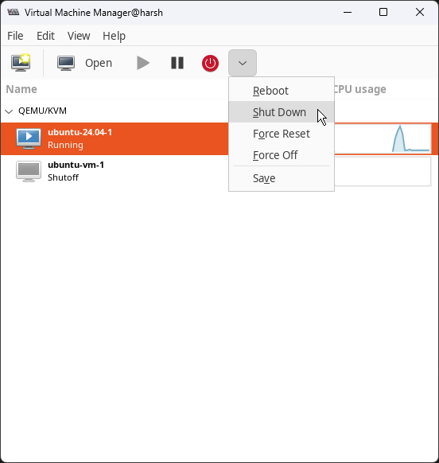
	<br />
    <sub>Click on a VM in the list and then choose the start, pause, reboot, shutdown, etc. options.</sub>
</p>

-   Change VM configuration

<p align="center">
    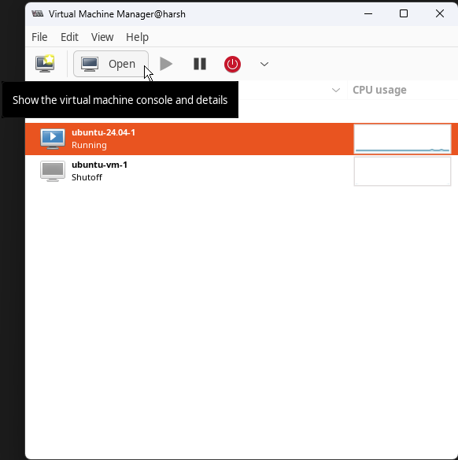
	<br />
    <sub>Select a VM in the list and then click on ‘Open’.</sub>
</p>

<p align="center">
    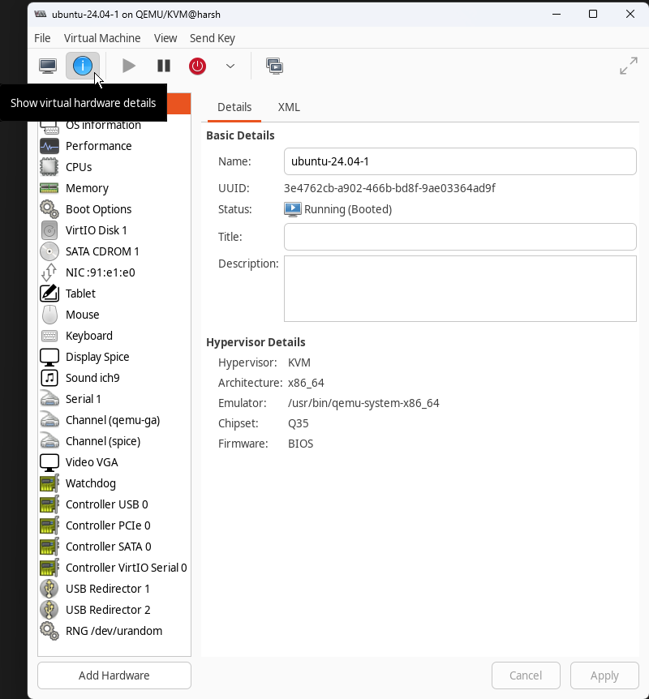
	<br />
    <sub>In the new VM window that opens up, click on the blue <code>i</code> symbol at the top to access VM configuration.</sub>
</p>

<p align="center">
    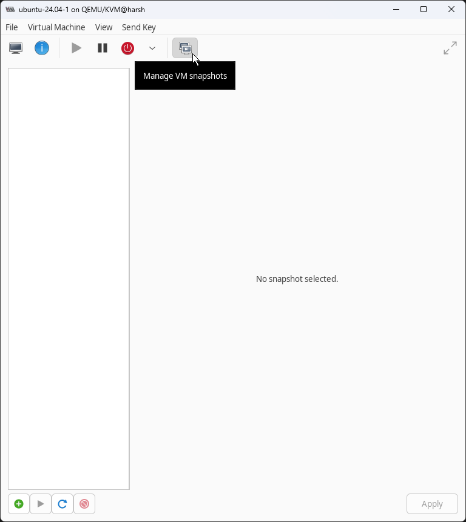
	<br />
    <sub>To manage VM snapshots, click on the rightmost button at the top of the VM window that opens up on clicking the ‘Open’ button in the main window of <code>virt-manager</code>.</sub>
</p>

### `virsh`

NOTE: virsh calls VMs ‘domains’.

-   List all VMs

    ```bash
    $ virsh list --all
     Id   Name             State
    ---------------------------------
     3    ubuntu-24.04-1   running
     6    ubuntu-vm-1      running
     -    rocky9-test-2    shut off
    ```

-   Start VM

    ```bash
    $ virsh start <vm_name_from_virsh_list>
    Domain '<vm_name_from_virsh_list>' started
    ```

-   Stop VM

    ```bash
    # Gracefully stop VM (preferred)
    $ virsh shutdown <vm_name_or_id_from_virsh_list>
    Domain '<vm_name_or_id_from_virsh_list>' is being shutdown

    # Force stop VM
    $ virsh destroy <vm_name_or_id_from_virsh_list>
    Domain '<vm_name_or_id_from_virsh_list>' destroyed
    ```

-   Delete VM

    ```bash
    # Stop the VM (use `virsh destroy` instead of `virsh shutdown` to be quicker) and then execute the command below
    $ virsh undefine <vm_name_or_id_from_virsh_list> --remove-all-storage
    Domain '<vm_name_or_id_from_virsh_list>' has been undefined
    Volume 'vda'(/path/to/storage_disk_volume.qcow2) removed.
    ```

-   Network management

    ```bash
    $ virsh net-list --all
    Name         State    Autostart   Persistent
    -----------------------------------------------
     default      active   yes         yes
     hostbridge   active   yes         yes
    $ virsh net-define /path/to/network/definition/file.xml
    $ virsh net-start <network_name>
    $ virsh net-autostart <network_name>
    $ virsh net-dhcp-leases <network_name>
    ```

-   Check VNC port

    ```bash
    $ virsh vncdisplay <vm_name_or_id_from_virsh_list>
    :1 # This means that the port number in the default case is 5901 (5900 + 1)
    ```

-   Snapshotting, modifying CPU and memory capacities, storage pool management, network management and more: [KVM Cheat Sheet of virsh commands - Virtualization Howto](https://www.virtualizationhowto.com/2023/04/kvm-cheat-sheet-of-virsh-commands)
-   All options can be found in [`virsh`'s documentation](https://www.libvirt.org/manpages/virsh.html).

## Accessing/Viewing VMs

### `virt-manager`

<p align="center">
    
	<br />
    <sub>Select a VM in the list and then click on ‘Open’.</sub>
</p>

<p align="center">
    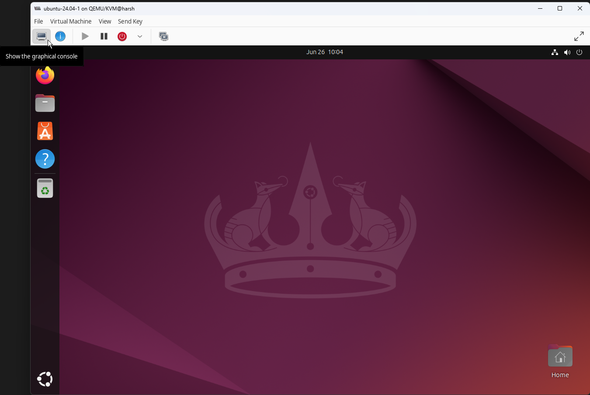
	<br />
    <sub>Click on the leftmost button at the top of the VM’s window that opens up, to access/view the VM.</sub>
</p>

### `vnc-viewers`

Virtual Network Computing (VNC) is a graphical desktop-sharing system used to remotely control another computer. It transmits keyboard and mouse input from one computer to another by relaying graphical-screen updates over a network.

KVM/QEMU provides a VNC server for every VM.

#### VNC Configuration

##### GUI

-   Start the VM from `virt-manager` (as shown above)
-   Under `virt-manager`'s VM configuration (config access method shown above)
    -   Go to the 'Display <protocol_name>' section.
    -   Ensure that the 'Type' field's value is 'VNC server'.
    -   Ensure that the 'Listen type' field's value is 'Address'.
    -   Ensure that the 'Address' field's value is 'Localhost only' (i.e., `localhost` or `127.0.0.1`, which makes VNC available only on the host machine) or 'All interfaces' (i.e., `0.0.0.0`, which makes VNC accessible from outside the host machine as well).
    -   Check the 'Port: Auto' checkbox and note the port number displayed beside it.
    -   Optionally provide a password for the VNC session.
    -   Click the 'Apply' button.
-   Shut the VM down and then start it again. (**Do not** reboot the VM.)

##### CLI

NOTE: VNC port numbers start from `5900` by default, unless configured otherwise. So, for the default case, if the port for VNC is listed as `:2`, then the port number for VNC is `5902` (`5900 + 2`).

-   Start the VM

    ```bash
    $ virsh list --all
    $ virsh start <vm_name_or_id_from_virsh_list>
    Domain '<vm_name_or_id_from_virsh_list>' started
    ```

-   Check the VNC port using the `virsh` command

    ```bash
    $ virsh vncdisplay <vm_name_or_id_from_virsh_list>
    :1 # This means that the port number in the default case is 5901 (5900 + 1)
    ```

-   Check the VNC URL using the `virsh` command

    ```bash
    $ virsh domdisplay <vm_name_or_id_from_virsh_list>
    vnc://localhost:1 # This means that VNC is available at `localhost` or `127.0.0.1` and at port no. 5901 (5900 default VNC port + 1)
    ```

#### Accessing VMs Remotely

If remote access for VNC is enabled, i.e., VNC config says listening on 'All interfaces' or on `0.0.0.0`, then VM interfaces should be accessible outside of the host machine.

-   Install a VNC viewer (client)
    -   [TigerVNC](https://tigervnc.org) is a good VNC client and server.
        -   [Download TigerVNC](https://github.com/TigerVNC/tigervnc/releases)
    -   Other VNC viewers can be used as well.
-   Start the VNC viewer
-   Enter the remote host server’s URL or hostname (**not** the guest VM's URL or hostname) and port number as noted while configuring VNC above: `<remote_host_ip_or_hostname>:<remote_host_vnc_port_for_vm>`

    <p align="center">
        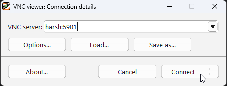
    	<br />
        <sub>TigerVNC viewer on a Windows laptop accessing a VM running on a remote host/machine.</sub>
    </p>

    -   If this doesn’t work

        -   SSH local port forwarding might be required, using the command

            ```bash
            $ ssh -L 127.0.0.1:<local_port>:127.0.0.1:<remote_host_vnc_port_for_vm> <host_server_username>@<host_server_ip_or_hostname>
            ```

        -   Then enter `127.0.0.1:<local_port>` in the VNC viewer.

-   A VNC screen should not be visible!

<p align="center">
	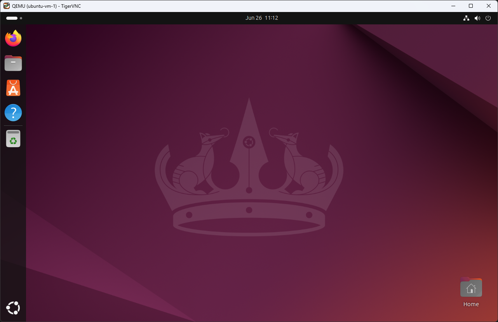
	<br />
	<sub>TigerVNC viewer on a Windows laptop accessing a VM running on a remote host/machine.</sub>
</p>

#### Accessing VMs Locally

VMs can be viewed locally on the host machine via `virt-viewer` (preferred and shown in the section below) or via VNC viewers.

For VNC viewers, the steps as shown above in [the 'Accessing VMs Remotely' section](#accessing-vms-remotely) remain the same. Please refer to that section above for instructions and replace the `remote_host_ip_or_hostname` with `localhost` or `127.0.0.1`.

### `virt-viewer`

`virt-viewer` can be used to view VMs locally (i.e., on the host).

```bash
$ virsh list --all
$ virsh start <vm_name_or_id_from_virsh_list>
$ virt-viewer <vm_name_or_id_from_virsh_list>
```

## Resources

-   Scripts: [dotfiles/kvm-qemu at main · HarshKapadia2/dotfiles](https://github.com/HarshKapadia2/dotfiles/tree/main/kvm-qemu)
-   KVM
    -   [KVM](https://linux-kvm.org)
    -   [AMD-V: What is AMD V? Exploring Virtualization Capabilities - GawLab](https://gawlab.net/what-is-amd-v-p481)
-   QEMU
    -   [QEMU](https://www.qemu.org)
-   Libvirt
    -   [libvirt - ArchWik](https://wiki.archlinux.org/title/Libvirt)
    -   `virt-install`
        -   [15 virt-install examples \| KVM virtualization commands cheatsheet \| GoLinuxCloud](https://www.golinuxcloud.com/virt-install-examples-kvm-virt-commands-linux/#15_virt-install_--pxe_and_--boot_network)
    -   `virsh`
        -   [KVM Cheat Sheet of virsh commands - Virtualization Howto](https://www.virtualizationhowto.com/2023/04/kvm-cheat-sheet-of-virsh-commands)
        -   Adding an extra network interface to VMs
            -   [linux - How to add an additional network interface on a KVM vm? - Unix & Linux Stack Exchange](https://unix.stackexchange.com/questions/671992/how-to-add-an-additional-network-interface-on-a-kvm-vm)
            -   [libvirt.org/formatdomain.html#network-interfaces](https://libvirt.org/formatdomain.html#network-interfaces)
-   Libguestfs
    -   [libguestfs, library for accessing and modifying VM disk images](https://libguestfs.org)
    -   OSs provided by `virt-builder`
        -   [https://libguestfs.org/virt-builder.1.html#sources-of-template](https://libguestfs.org/virt-builder.1.html#sources-of-templates)
        -   [builder.libguestfs.org/index.asc](https://builder.libguestfs.org/index.asc)
        -   [guestfs-tools/builder/templates at master · libguestfs/guestfs-tools](https://github.com/libguestfs/guestfs-tools/tree/master/builder/templates)
-   KVM vs QEMU vs Libvirt vs Libguestfs
    -   [Virt Tools](https://libvirt.gitlab.io/virttools-web)
    -   [virtualization - What is the difference between QEMU, KVM, Libvirt, and how to use with Vagrant? Are all 3 needed to work together? - Stack Overflow](https://stackoverflow.com/questions/60907105/what-is-the-difference-between-qemu-kvm-libvirt-and-how-to-use-with-vagrant/61324275#61324275)
    -   [virtualization - Difference between KVM and QEMU - Server Fault](https://serverfault.com/questions/208693/difference-between-kvm-and-qemu) (Read all answers)
    -   [understanding relationship between Qemu and KVM](https://serverfault.com/a/392145)
-   Articles on KVM/QEMU basics, and setup and spin-up instructions
    -   [Setting up KVM virtual machines using a bridge network on an Ubuntu host • Chris Dzombak](https://www.dzombak.com/blog/2024/02/setting-up-kvm-virtual-machines-using-a-bridged-network)
    -   Series
        -   [Virtualization and Hypervisors :: Explaining QEMU, KVM, and Libvirt \| Sumit’s Space](https://sumit-ghosh.com/posts/virtualization-hypervisors-explaining-qemu-kvm-libvirt)
        -   [Creating a VM using Libvirt, Cloud Image and Cloud-Init \| Sumit’s Space](https://sumit-ghosh.com/posts/create-vm-using-libvirt-cloud-images-cloud-init)
    -   [Using virt-builder & virsh to create, customize, and manage VMs](https://kashyapc.fedorapeople.org/using-virt-builder.html)
    -   [How To Build Virtual Machine Images With Virt-builder - OSTechNix](https://ostechnix.com/quickly-build-virtual-machine-images-with-virt-builder)
-   VNC
    -   [KVM Virtualization: Start VNC Remote Access For Guest Operating Systems - nixCraft](https://www.cyberciti.biz/faq/linux-kvm-vnc-for-guest-machine)
    -   [How To Install and Configure TigerVNC server on Ubuntu - nixCraft](https://www.cyberciti.biz/faq/install-and-configure-tigervnc-server-on-ubuntu-18-04)
-   `cloud-init`
    -   `cloud-init`’s `autoinstall` vs `cloud-init`’s `user-data`
        -   [system installation - Installing packages via autoinstall vs user-data - Ask Ubuntu](https://askubuntu.com/questions/1473018/installing-packages-via-autoinstall-vs-user-data)
        -   [Cloud-init and autoinstall interaction - Ubuntu installation documentation](https://canonical-subiquity.readthedocs-hosted.com/en/latest/explanation/cloudinit-autoinstall-interaction.html)
    -   [Autoinstall configuration reference manual](https://canonical-subiquity.readthedocs-hosted.com/en/latest/reference/autoinstall-reference.html)
    -   [virt-install --cloud-init support \| Cole Robinson](https://blog.wikichoon.com/2020/09/virt-install-cloud-init.html)

---

[Back home](README.md)
